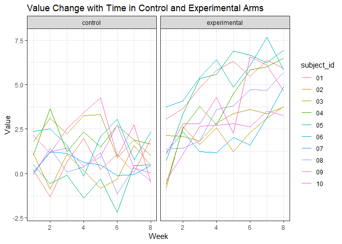
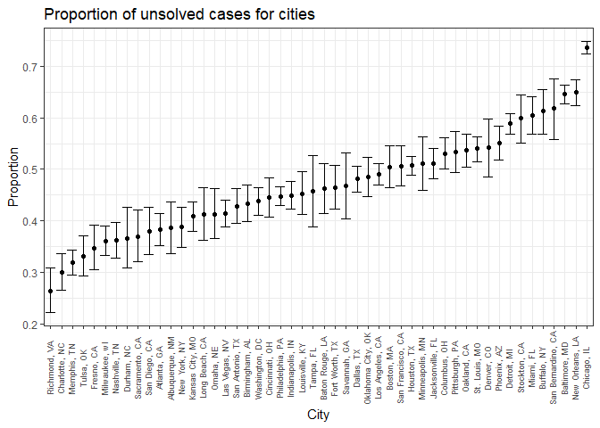

taosha92.github.io
================
Sha Tao
November 11, 2019

Problem 1\_1 Data Loading
-------------------------

``` r
read_csv_hw5 = function(x) {
  
  read_csv(x) %>% 
    mutate(name = x)

}

file_list = list.files("./data/") %>% paste0("./data/", .)

study = map_dfr(file_list, read_csv_hw5) %>% 
  mutate(arm = ifelse(str_detect(name, "con") == TRUE, "control", "experimental"),
         subject_id = substr(name, 12, 13)) %>% 
  gather(key = week, value = value, week_1:week_8) %>% 
  mutate(week = str_replace(week, "week_", ""),
         subject_id = as.factor(subject_id),
         week = as.integer(week)) %>% 
  select(subject_id, arm, week, value) %>% 
  arrange(subject_id, arm, week)
```

The dataset study after clean has 4 columns and 160 rows.
This dataset contains two arms, each records 10 subjects across 8 weeks.

Problem 1\_2 Spaghetti Plots
----------------------------

``` r
ggplot(study, aes(x = week, y = value, color = subject_id)) +
  geom_line() +
  facet_grid(.~ arm) +
  labs(
    title = "Value Change with Time in Control and Experimental Arms",
    x = "Week",
    y = "Value"
    )
```



The subjects in control arms started at the range of (0, 2.5), and ended up at approximately the same range at 8 week, while the subjects in experimental arms started at the range of (-0.5, 3.75), and ended up at the range of (3.5, 7).
In other words, there is no apparent change of value with time in control arms, while there is increasing in experimental arm.

Problem 2\_1 Data Loading
-------------------------

``` r
p2_dataset = 
  RCurl::getURL("https://raw.githubusercontent.com/washingtonpost/data-homicides/master/homicide-data.csv") %>%
    read_csv()
```

Problem 2\_2 Data Cleaning
--------------------------

``` r
homicides =
  p2_dataset %>% 
  mutate(reported_year = as.integer(substr(reported_date, 1, 4)),
         reported_month = month.abb[as.integer(substr(reported_date, 5, 6))],
         reported_day = as.integer(substr(reported_date, 7, 8)),
         victim_race = as.factor(victim_race),
         victim_age = as.integer(victim_age),
         victim_sex = as.factor(victim_sex),
         city_state = paste(paste0(city, ","), state)) %>% 
  select(uid, reported_year, reported_month, reported_day, victim_last:victim_sex, city_state, lat:disposition)
```

Problem 2\_3 Data Exploring
---------------------------

``` r
homicides %>% 
  select(uid, reported_year, reported_month, reported_day, victim_race, victim_age, victim_sex, city_state,
         lat, lon, disposition) %>% 
  skimr::skim()
```

    ## Skim summary statistics
    ##  n obs: 52179 
    ##  n variables: 11 
    ## 
    ## -- Variable type:character ----------------------------------------------------------------------------
    ##        variable missing complete     n min max empty n_unique
    ##      city_state       0    52179 52179   9  18     0       51
    ##     disposition       0    52179 52179  14  21     0        3
    ##  reported_month       0    52179 52179   3   3     0       12
    ##             uid       0    52179 52179   9  10     0    52179
    ## 
    ## -- Variable type:factor -------------------------------------------------------------------------------
    ##     variable missing complete     n n_unique
    ##  victim_race       0    52179 52179        6
    ##   victim_sex       0    52179 52179        3
    ##                                   top_counts ordered
    ##  Bla: 33361, His: 6901, Whi: 6333, Unk: 4199   FALSE
    ##      Mal: 40739, Fem: 7209, Unk: 4231, NA: 0   FALSE
    ## 
    ## -- Variable type:integer ------------------------------------------------------------------------------
    ##       variable missing complete     n    mean    sd   p0  p25  p50  p75
    ##   reported_day       0    52179 52179   15.83  8.91    1    8   16   23
    ##  reported_year       0    52179 52179 2012.33  3.17 2007 2010 2012 2015
    ##     victim_age    2999    49180 52179   31.8  14.42    0   22   28   40
    ##  p100     hist
    ##    31 <U+2587><U+2587><U+2587><U+2587><U+2586><U+2587><U+2587><U+2587>
    ##  2017 <U+2586><U+2582><U+2583><U+2587><U+2583><U+2583><U+2583><U+2587>
    ##   102 <U+2581><U+2587><U+2587><U+2583><U+2582><U+2581><U+2581><U+2581>
    ## 
    ## -- Variable type:numeric ------------------------------------------------------------------------------
    ##  variable missing complete     n   mean    sd      p0    p25    p50    p75
    ##       lat      60    52119 52179  37.03  4.35   25.73  33.77  38.52  40.03
    ##       lon      60    52119 52179 -91.47 13.75 -122.51 -96    -87.71 -81.76
    ##    p100     hist
    ##   45.05 <U+2581><U+2583><U+2582><U+2585><U+2583><U+2587><U+2586><U+2581>
    ##  -71.01 <U+2583><U+2581><U+2581><U+2582><U+2583><U+2587><U+2585><U+2585>

The dataset homicides contains 160 observations.
There are 2999 missing observations in victim\_age, and 60 missing observations in latitude and longitude each.  The mean victim age is 31.8 while median is 28.
Black victims number (33361) is unproportionally larger than all the other race combined.
There were 40739 male victims, and 7209 female victims in total.

Problem 2\_4 Count Homicides
----------------------------

``` r
total_homicides = 
  homicides %>%
  group_by(city_state) %>% 
  summarize(total_n = n())

unsolved_homicides = 
  homicides %>% 
  filter(disposition == "Closed without arrest" | disposition == "Open/No arrest") %>% 
  group_by(city_state) %>% 
  summarize(unsolved_n = n())

# join total_homicides and unsolved_homicides into one dataframe
count_homicides =
  inner_join(total_homicides, unsolved_homicides, by = "city_state")
```

Problem 2\_5 Baltimore, MD
--------------------------

``` r
# filter Baltimore  
baltimore_homicides = 
  count_homicides %>% 
  filter(city_state == "Baltimore, MD")

# compute the Baltimore proportion test
baltimore_prop = 
  prop.test(baltimore_homicides$unsolved_n, baltimore_homicides$total_n)

# save baltimore_prop as an object
save(baltimore_prop, file = "Baltimore_prop_test.RData")

# broom tidy, select only parameter estimate, and 95% CI
baltimore_prop =
  baltimore_prop %>% 
  broom::tidy() %>% 
  select(estimate, conf.low, conf.high)

# Display Baltimore proportion test table
baltimore_prop %>% 
  knitr::kable()
```

|   estimate|   conf.low|  conf.high|
|----------:|----------:|----------:|
|  0.6455607|  0.6275625|  0.6631599|

Problem 2\_6 All City
---------------------

``` r
# create function for all city proportion test
allcity_prop_test = function(x){
  
  city_homicides = 
    count_homicides %>% 
    filter(city_state == x)
  
  prop.test(city_homicides$unsolved_n, city_homicides$total_n) %>% 
    broom::tidy() %>% 
    select(estimate, conf.low, conf.high)
}

# compute city proportion test
city_prop = 
  tibble(city_state = count_homicides$city_state) %>% 
  mutate(map(.x = count_homicides$city_state, ~allcity_prop_test(.x))) %>% 
  unnest
```

Problem 2\_7 Proportion and 95% CI Plot
---------------------------------------

``` r
city_prop %>% 
  ggplot(aes(x = reorder(city_state, estimate), y = estimate)) +
    geom_point() +
    geom_errorbar(aes(ymin = conf.low, ymax = conf.high)) +
    theme(axis.text.x = element_text(angle = 90, vjust = 0.3, size = 7)) +
    labs(
      x = "City",
      y = "Proportion",
      title = "Proportion of unsolved cases for cities"
    )
```



Chicago, New Orleans and Baltimore had the three highest proportion of parameter estimates while had a relatively small 95% confidence interval.
Among them, Chigago had significantly higher proportion than the others.
Richmond, Charlotte and Memphis had the three lowest proportion of parameter estimates.
